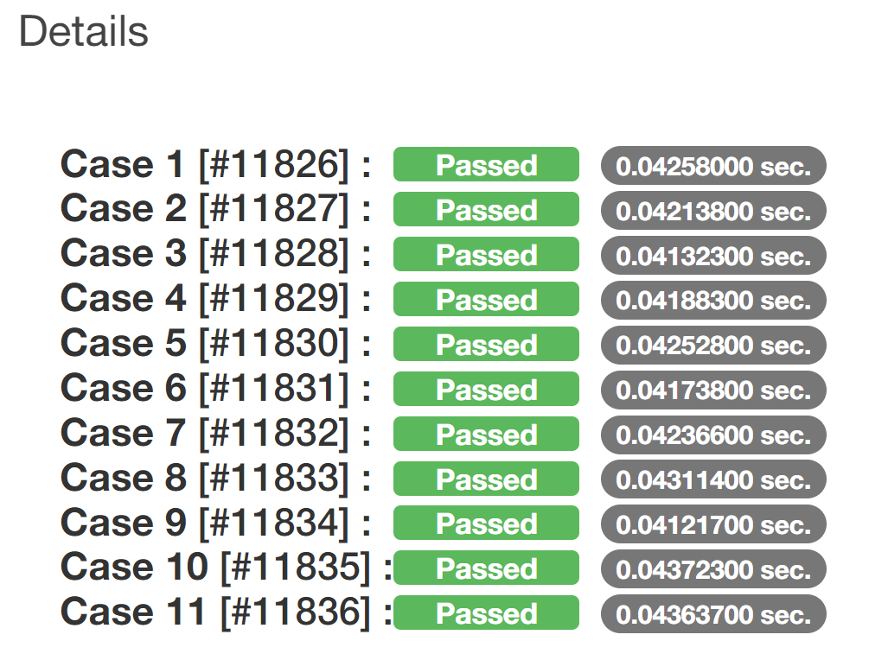
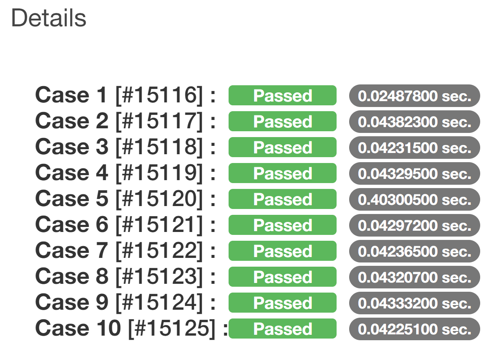
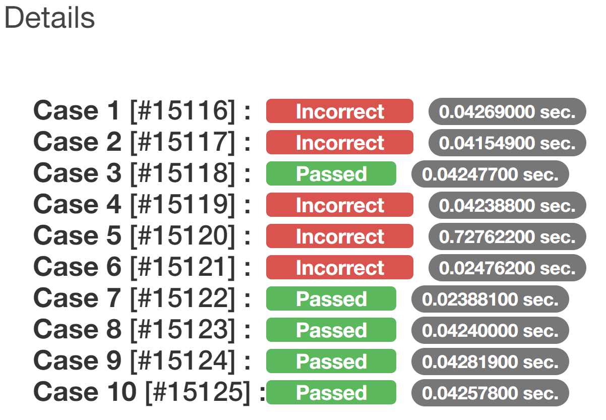
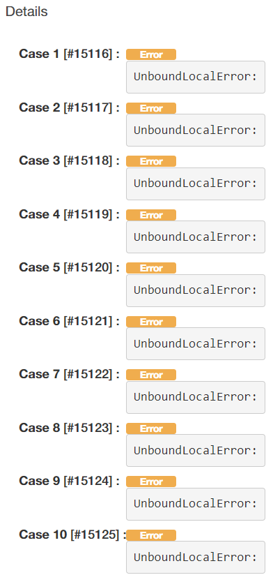

# The "Good" \<e>Judge Guideline

## Good Code 😊

### Optimal code
Yes! you did it you didn't fucked up.
 

 

### Nonoptimal code

Yes! you did it but you didn't respect PEP-8 formatting guidelines.

 
`C: 29, 0: Line too long (101/100) (line-too-long)`

## Bad Code 😭

### Typical Failure

You failed. Are you a mistake? not the code but you.

 

### Do you even know how to code?

Get some help.

 

